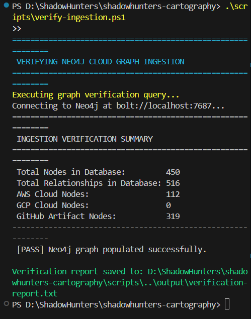
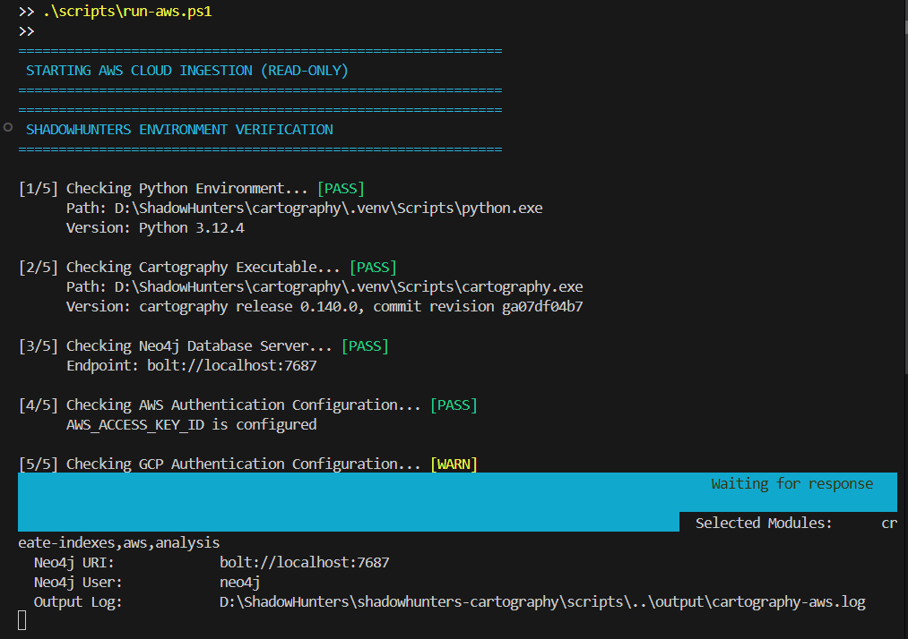
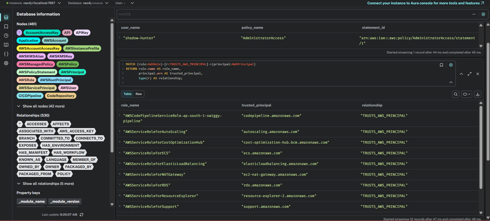
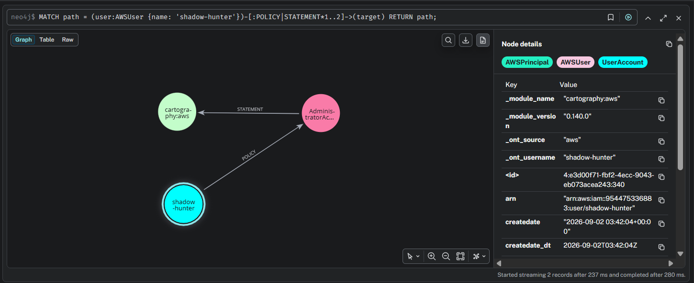
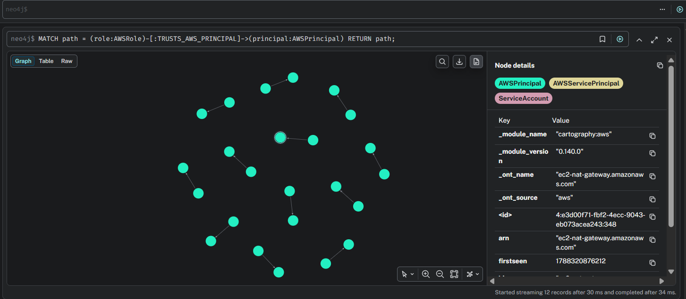

# ShadowHunters Visual Demonstration & Screenshot Guide

This visual guide documents the live execution, verification, and Neo4j graph security analysis of the **ShadowHunters Multi-Cloud Cartography** pipeline using screenshots captured directly from the live environment.

---

## 1. Execution & Environment Verification

### A. AWS Cloud Ingestion Execution (`.\scripts\run-aws.ps1`)
The runner script performs environment validation, resolves Python and Cartography executables, checks Neo4j connectivity, and launches read-only ingestion.



---

### B. Graph Ingestion Verification (`.\scripts\verify-ingestion.ps1`)
After ingestion completes, the verification script queries Neo4j and confirms that cloud resources and relationships were successfully populated in the database.



**Key Verification Metrics:**
- **Total Nodes in Database**: `450`
- **Total Relationships in Database**: `516`
- **AWS Cloud Nodes**: `112`
- **Status**: `[PASS] Neo4j graph populated successfully`

---

## 2. Neo4j Security Graph Analysis

### A. IAM Administrator Privilege Analysis & Trust Records
Querying Neo4j Browser reveals high-privilege IAM users (`shadow-hunter` attached to `AdministratorAccess`) and maps service trust relationships across AWS roles.



---

### B. Visual Graph: IAM User to Policy Statement Chain
Neo4j Browser graph view displaying the directional relationship chain from the `shadow-hunter` IAM user node to `AdministratorAccess` and its policy statement.



**Graph Traversal Pattern:**
```
(shadow-hunter: AWSUser) 
    ──[POLICY]──> (AdministratorAccess: AWSManagedPolicy) 
                      ──[STATEMENT]──> (cartography:aws: AWSPolicyStatement)
```

---

### C. Visual Graph: AWS IAM Service Trust Network Ring
Visual network representation of 12 AWS IAM Roles (`AWSRole`) and their trusted AWS Service Principals (`AWSPrincipal` / `ServiceAccount`).



---

## 3. Summary of Visual Demonstrations

| Stage | Script / Query | Output Asset | Key Finding |
| :--- | :--- | :--- | :--- |
| **Ingestion** | `.\scripts\run-aws.ps1` | `docs/images/01_ingestion_execution.png` | Successful read-only API sync |
| **Verification** | `.\scripts\verify-ingestion.ps1` | `docs/images/02_ingestion_verification.png` | 112 AWS nodes & 516 relationships |
| **IAM Table Audit** | Table Query | `docs/images/03_neo4j_table_analysis.png` | Identified `AdministratorAccess` user |
| **User Graph** | `MATCH path = (user:AWSUser)...` | `docs/images/04_neo4j_user_policy_graph.png` | Visual policy node chain |
| **Trust Network** | `MATCH path = (role:AWSRole)...` | `docs/images/05_neo4j_graph_ring.png` | Visual 12-role trust ring layout |
